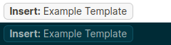
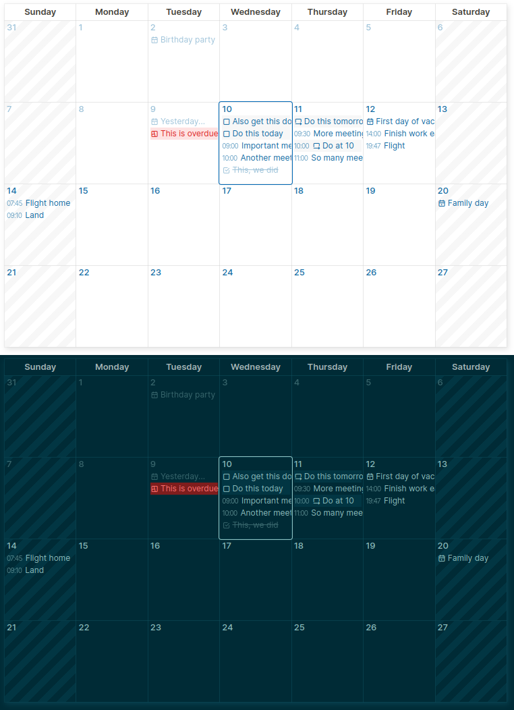
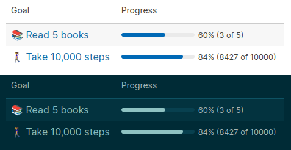
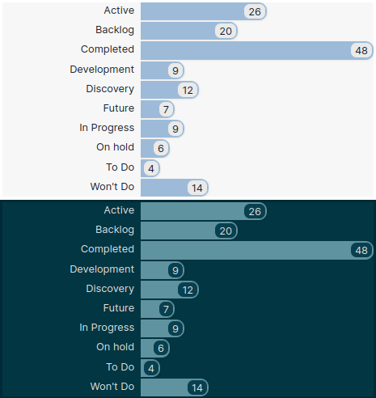

# Logseq Modules

Logseq Modules is a system for extending  [Logseq](https://logseq.com) without plugins.

This project provides a number of macros to use in your Logseq graphs and a Python script to install them.

It also provides a means of working on several such macros as separate _modules_, each of which is then _compiled_ into your graph's `config.edn` and `custom.css` files. This is done in a predictable manner that's easy to uninstall.

Feel free to install these modules as is, or use them as a basis for your own customizations.

Note that since these are not plugins, they will work on all platforms including mobile.

## What's in the Box?

### Template Button

This macro presents a button that, when clicked, inserts a named template after or replacing the current block.
[Read more...](./modules/template-button/README.md)



### Calendar

This macro produces a calendar displaying recent and future events/tasks.
[Read more...](./modules/calendar/README.md)



### Goals

_Goals_ is a system for establishing, working towards and reviewing a set of goals.
[Read more...](./modules/goals/README.md)



### Progress Bar

This macro displays a simple progress bar.
[Read more...](./modules/progress-bar/README.md)


### Bar Chart

Bar Chart can be used as a macro (summarizing a given property) or as a `:view` for your own advanced queries.
[Read more...](./modules/bar-chart/README.md)



## Installation

The `install.py` script is used to install all modules. Point it to the directory named `logseq` inside the graph:
```
python3 install.py /path/to/your/graph/logseq
```
To preview what the installation _would_ do, pass the `--diff` flag:
```
python3 install.py --diff /path/to/your/graph/logseq
```
This disables installation only showing the differences. Adding the `--apply` flag too will also apply the changes.
```
python3 install.py --diff --apply /path/to/your/graph/logseq
```

### Uninstallation

To remove the installed modules, use the `--uninstall` flag.
```
python3 install.py --uninstall /path/to/your/graph/logseq
```

## Developing Modules

Each module can make use of Logseq's [macros](https://docs.logseq.com/#/page/macros), custom [CSS styling](https://docs.logseq.com/#/page/custom.css) and [Advanced Queries](https://docs.logseq.com/#/page/advanced%20queries) (with custom result transforms and views).

A module is defined by a named subdirectory within the `modules` top level directory. It may contain one or more of the following files:
```
modules/
  <name-of-module>/
    macro[.query].clj
    query-transform.clj
    query-view.clj
    style.css
```
On running `install.py`, the contents of each of these files is collected, [transformed](#transformations) then inserted into the relevant file and section of Logseq's configuration.

Entries are added to the graph's config file (`logseq/config.edn`) under the `:macros`, `:query/result-transforms` and `:query/views` sections. Styling is added to the `logseq/custom.css` file.

All entries are inserted in a block like this making updates and removal easy:
```clojure
;; <logseq-modules query-views>
...
;; </logseq-modules query-views>
```
```css
/* <logseq-modules styles> */
...
/* </logseq-modules styles> */
```

### Transformations

To aid in the development of modules, certain files are edited as Clojure files, then transformed into the proper form for `config.edn`.

- The contents of a `macro.clj` file are encased in a string and placed into `logseq/config.edn` within the `:macros` mapping, under the `:<name-of-module>` key. Any double-quote or backslash characters are properly escaped.
  ```clojure
  ;; File: config.edn
  {:macros
   {:<name-of-module> "<string-escaped-file-content>"}}
  ```
  See [progress-bar/macro.clj](./modules/progress-bar/macro.clj) for an example.

- The contents of a `macro.query.clj` file is automatically surrounded by a `#+BEGIN_QUERY`...`#+END_QUERY` block, and similar string escaped. Embedding advanced queries in macros is enabled by inserting a blank line before the query (thanks to [this comment](https://discuss.logseq.com/t/is-it-possible-with-macros-to-run-a-db-query-for-a-block-id-an-build-the-embed-block-id-inside-a-page/20952/16?u=iant) in the Logseq forums). This transformation allows queries to be written as Clojure source files, with these requirements handled automatically. An example transformation looks like this:
  
  Source:
  ```clojure
  ;; File: modules/<name-of-module>/macro.query.clj
  {:title "Hello \"$1\""}
  ```

  Result:
  ```clojure
  ;; File: config.edn
  {:macros
   {:<name-of-module> "\n#+BEGIN_QUERY
   {:title \"Hello \\\"$1\\\"\"}
    #+END_QUERY"}}
  ```
  See [calendar/macro.query.clj](./modules/calendar/macro.query.clj) for an example.

- The contents of `query-transform.clj` and `query-view.clj` are copied as-is under the `:query/result-transforms` and `:query/views` sections of `config.edn`, respectively. These are kept as Clojure code snippets with no escaping necessary.
  
  ```clojure
  ;; File: config.edn
  {:macros
   {:<name-of-module> "<string-escaped-file-content>"}

   :query/result-transforms
   {:<name-of-module> <file-content>}
   
   :query/views
   {:<name-of-module> <file-content>}}
  ```
  See [bar-chart/query-view.clj](./modules/bar-chart/query-view.clj) for an example.

### Further Notes

The `$1`-like arguments to macros are unaffected by the transformations and can be used normally.

The directory name (`<name-of-module>`) is used to name the macro, result-transform and view. These names can be used within the same module or even across modules. For example, a module could provide a view that is used by several other modules, or even serve as a `:view` to advanced queries throughout the graph.

In CSS, to target the macro body (and sub-elements), the `div.macro[data-macro-name="<name-of-module>"]` selector can be used. Classes may also be used but it is important to make sure names are unique and do not collide with Logseq's own. The provided modules use `lsm-` as a prefix for this reason.

## Configuration

Some configuration is possible via the `config.json` file, particularly to add another directory for inclusion. The following structure is currently the only one supported: `<directory-name>/<name-of-module>/<file-pattern>.clj`.

## Disclaimer

While every attempt has been made to ensure the insertion logic is sound, usual caution should be taken. This tool is provided as-is with absolutely no warranty. Use at your own risk and back up your files.
