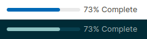

# Logseq Widgets

This project brings a selection of widgets to [Logseq](https://logseq.com) that can be used throughout your graph. Not only that, but the installation system allows you to write your own widgets much more easily by dropping them into the widgets directory, rather than trying to maintain a lengthy `config.edn` by hand.

These are not plugins and as such they will work on all platforms including mobile.

## What You Get in The Box

| Widget | Preview |
|--------|---------|
| [Progress Bar](./widgets/progress-bar) |  |
| [Template Button](./widgets/template-button) |  |

## How it Works

I like to know how things work before I install them. If you don't, feel free to skip this bit.

Each widget makes use of Logseq's [macros](https://docs.logseq.com/#/page/macros), custom [CSS styling](https://docs.logseq.com/#/page/custom.css), and [Advanced Queries](https://docs.logseq.com/#/page/advanced%20queries) (with custom result transforms and views).

During installation, entries are added to the graph's config file, `logseq/config.edn`, under the `:macros`, `:query/result-transforms`, and `:query/views` sections. Styling is added to the `logseq/custom.css` file.

All entries are inserted in a block that looks like this:
```clojure
;; <logseq-widgets query-views>
...
;; </logseq-widgets query-views>
```
```css
/* <logseq-widgets styles> */
...
/* </logseq-widgets styles> */
```

making updates and removal easy.

Note: while I made every attempt to make the insertion logic sound, usual caution should be taken. This tool is provided as-is with absolutely no warranty. Use at your own risk (and back up your files). See below for how to preview the changes before applying them.

## Installation

You could manually add any of the widgets to the config file, or use the `install.py` script to install them automatically. Just point it to the directory named `logseq` inside your graph:
```
python3 install.py /path/to/your/graph/logseq
```
If you want to preview what the installation would do, you can offer a secondary output directory:
```
mkdir /tmp/preview
python3 install.py /path/to/your/directory/named/logseq --output-directory /tmp/preview
```
To remove the widgets, use the `--uninstall` flag.

If you want only some of the widgets, move the others out of the `widgets` directory (say, into `widgets-disabled`) and they won't be installed.
