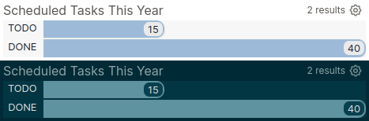

# Bar Chart

A view and example query macro for displaying a bar chart of counts.

### Usage

#### Macro
```
{{bar-chart <title>, <property-name>}}
```
- `<title>` - the title to display at the top of the chart.
- `<property-name>` - the name of a property to query across all blocks and count up its unique values.

#### Query View
```clojure
(fn [value-counts] ...)
```
- `value-counts` - a sequence of mappings, each with keys `:value` and `:count`

### Example

#### Macro
```
{{template-button Example Template, remove}}
```
> 

#### Query View

The bar chart view can be used in your own queries. For example, the following lists all tasks scheduled in the past year and counts their marker states:
```clojure
#+BEGIN_QUERY
{:title "Scheduled Tasks This Year"
 :inputs [:-365d :today]
 
 :query
 [:find ?value (count ?block)
  :keys value count
  :in $ ?year-ago ?today
  :where
  [?block :block/marker ?value]
  [?block :block/scheduled ?day]
  [(> ?day ?year-ago)]
  [(<= ?day ?today)]]
 
 :result-transform (fn [value-counts] (sort-by :count value-counts))
 
 :view :bar-chart}
#+END_QUERY
```


