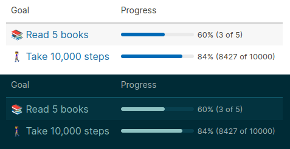

# Goals

A macro for summarizing goals

### Usage

```
{{goals}}
```

#### Goal Definition
```
• <label>
  goal:: <key>
  goal-target:: <target>
```
- `<label>` - A label to display for the goal target
- `<key>` - A unique name to use for referencing the goal
- `<target>` - The number that this goal aims to achieve

#### Goal Increment
```
• ...
  goal:: <key>

• ...
  goal:: <key>
  goal-add:: <add>
```
- `<key>` - The unique key of the goal's definition
- `<add>` - The number to add to the achieved portion towards this goal. If not given, 1 is used as a default.

Task markers are also taken into account so only the latter of these will be considered when adding the achieved portion towards the goal.
```
• TODO ...
  goal:: <key>
  goal-add:: <add>

• DONE ...
  goal:: <key>
  goal-add:: <add>
```

### Example
Definitions:
```
• Read 5 books
  goal:: books
  goal-target:: 5

• Complete 10,000 steps
  goal:: steps
  goal-target:: 10000
```
Increments:
```
• Read *Hitchhiker's Guide to The Galaxy*
  goal:: books

• Read *The Restaurant at the End of the Universe*
  goal:: books

• DONE Read *Life, the Universe and Everything*
  goal:: books

• TODO Read *So Long, and Thanks for All the Fish*
  goal:: books

• TODO Read *Mostly Harmless*
  goal:: books

• Took 4,307 steps
  goal:: steps
  goal-add:: 4307

• Walked 4,120 steps
  goal:: steps
  goal-add:: 4120
```

> 
