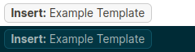

# Template Button

A button for inserting a template as a sibling under the current block.

### Usage
```
{{template-button <template-name>[, <remove-flag>]}}
```
- `<template-name>` - the name of a template, as set by the `template::` property of a block, to insert.
- `<remove-flag>` (written as `remove` or not set) - whether the button should be removed once the template has been inserted.
### Example
```
{{template-button Example Template, remove}}
```
> 
